<div id="top" align="center">
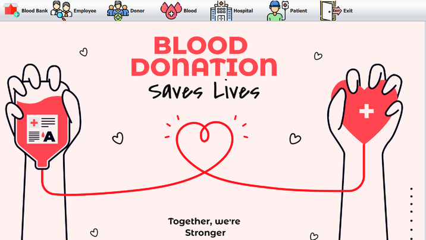
</div>
<!-- PROJECT LOGO -->
<div align="center">
<h1 align="center">BLOOD DONATION MANAGEMENT SYSTEM </h1>
  <h3 align="center">
    Blood Donation Management system for Principle Database of Management course <br> International University - VNU
    <br />
    <br />
  </h3>

[![Contributors][contributors-shield]][contributors-url]
[![Forks][forks-shield]][forks-url]
[![Issues][issues-shield]][issues-url]

</div>
<!-- About -->

# ABOUT 👀

## 1. Members
| No.| Full Name |Student's ID | Email | Github account |  | 
|:--:| :-------------------: | :---------: | :------------------------------: | :-----------------------------: | :--------------------: |
| 1 | Nguyễn Trần Hoàng Hạ| ITITIU21127 | ITITIU21127@student.hcmiu.edu.vn |[hahoang03](https://github.com/hahoang03)|  |
| 2 | Ngô Thị Thương | ITCSIU21160 | ITCSIU21160@student.hcmiu.edu.vn |[thuongngo050902](https://github.com/thuongngo050902)| 
| 3 | Nguyễn Phạm Kỳ Phương | ITITIU21287 | ITITIU21287@student.hcmiu.edu.vn |[npkyphuong04](https://github.com/npkyphuong04)| 
| 4 | Lê Đăng Khoa | ITITIU21227 | ITITIU212274@student.hcmiu.edu.vn |[Khoakhoa2812](https://github.com/Khoakhoa2812)| 
| 5 | Nguyễn Anh Thắng | ITCSIU21233 | ITCSIU21233@student.hcmiu.edu.vn |[nathang0147](https://github.com/nathang0147)|  

<br />

## 2. The project we are working on
- The Blood Donation System involves many resources to manage the blood donation process.

- The project provides a valuable opportunity to apply database management principles to a real-life problem in the field of Blood Donation management. It highlights the importance of effective and reliable data management in this sector. The thoughtful approach to system features and design demonstrates a commitment to developing a robust blood donation management system. The project showcases the practical application of database management principles in solving blood donation data management challenges.
<br />

## 3. Task distribution

| Order | Tasks                                    |  Member   | Contribution |
| :---- | :-------------------------------------- | :-------: | :----------: |
| 1     | Database Developer, Data Analyst        | Ngo Thuong  |      20%      |
| 2     | Interface Developer, Data Analyst       | Dang Khoa    |      20%      |
| 3     | Interface Developer                     | Hoang Ha |      20%      |
| 4     | Interface Developer                     | Ky Phuong  |      20%     |
| 5     | Interface Developer                     | Anh Thang  |      20%     |

<br />

## 4. Techniques
- Language: [SQL Server](https://www.microsoft.com/en-us/sql-server/sql-server-downloads), [Java](https://www.java.com/en/)
- Compiler: [IntelliJ](https://www.jetbrains.com/idea/), [Visual Studio Code](https://code.visualstudio.com)
- ERD drawing platform: [Draw.io](https://app.diagrams.net/)
- Library: [JavaSwing](https://openjfx.io)
- Online database storage: [ASP hosting](http://freeasphosting.net/)

<!-- METHODOLOGY -->
<br />

# HOW TO USE 🧠
<br />
 **LOGIN PAGE**: Require users to enter the correct account and password to log in for people who have used the system, sign up for first time users of the system, or explorer mode for system administrators
<br />
<div align="center">
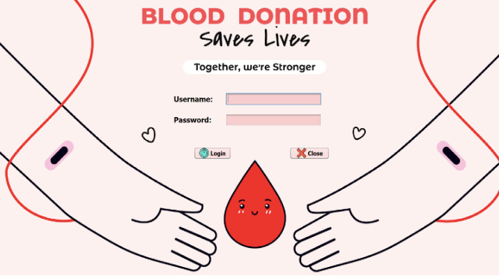
</div>
<br />

 **HOME PAGE**:  The main interface of the website with Buttons include: BloodBank, Employee, Donor, Blood, Hospital, Patient to access the system components. Exit button to exit the system
<br />
<div align ="center">

</div>

<br />

**ADD NEW DONOR**: This is the Donor interface, representing a component in the system. We can add new Donors here.
<br />
<div align ="center">
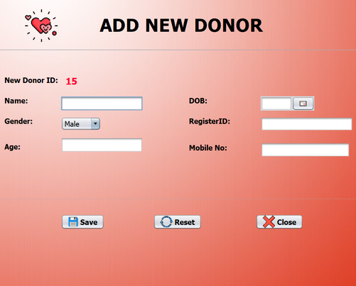
</div>

<br />

**ADD NEW EMPLOYEE**: We can add new Employee here.
<br />
<div align ="center">
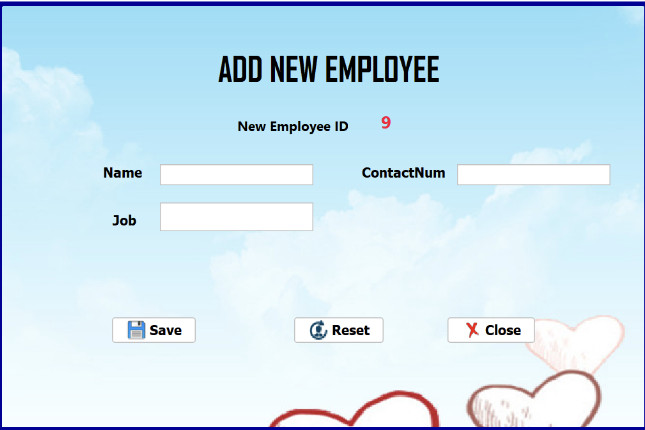
</div>

<br />

**ADD NEW PATIENT**: We can add new Patient here.
<br />
<div align ="center">
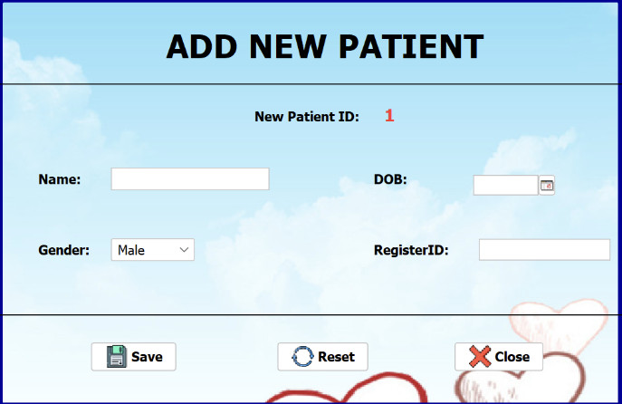
</div>

<br />

**All DONOR DETAILS **: This is the display of Donor details
<br />
<div align ="center">
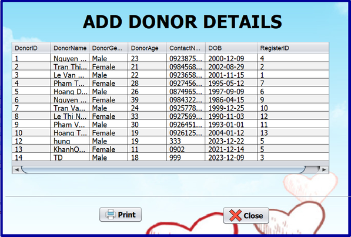
</div>

<br />
**All EMPLOYEE DETAILS **: This is the display of Employee details
<br />
<div align ="center">
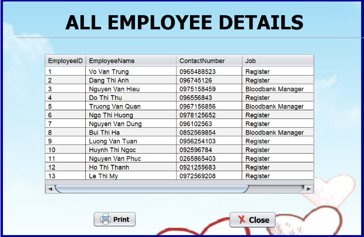
</div>

<br />

** SEARCH DONOR DETAILS **: Details about Donor can be found here
<br />
<div align ="center">
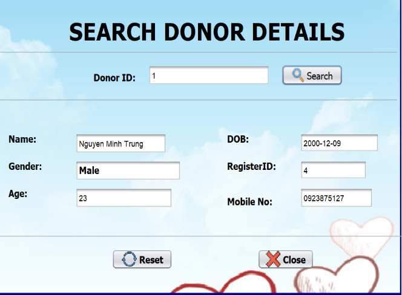
</div>

<br />
** SEARCH EMPLOYEE **: Employee can be found here
<br />
<div align ="center">
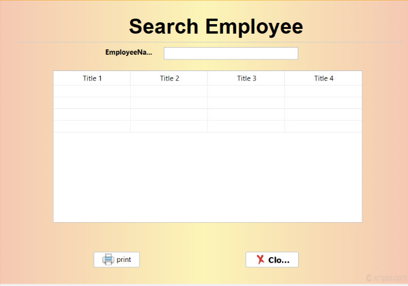
</div>

<br />

** UPDATE DONOR DETAILS **: Details about Donor can be update here
<br />
<div align ="center">
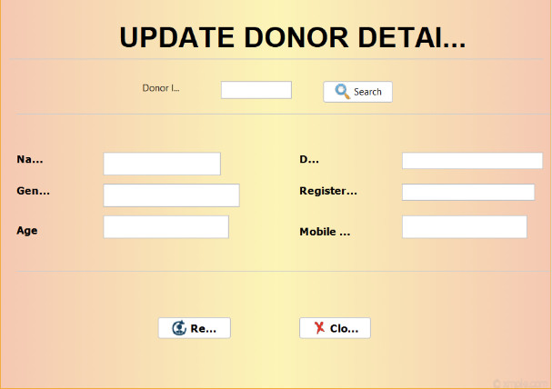
</div>

<br />
** UPDATE EMPLOYEE DETAILS **: Details about Employee can be update here
<br />
<div align ="center">

</div>

<br />


# ENTITY RELATIONSHIP DIAGRAM (ERD) 📚

<br />
<div align ="center">
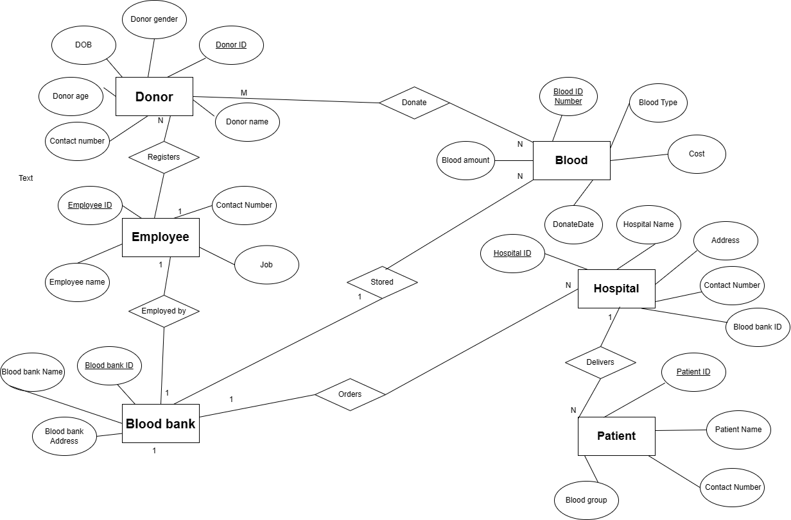
</div>

<br />

<br />
<div align ="center">
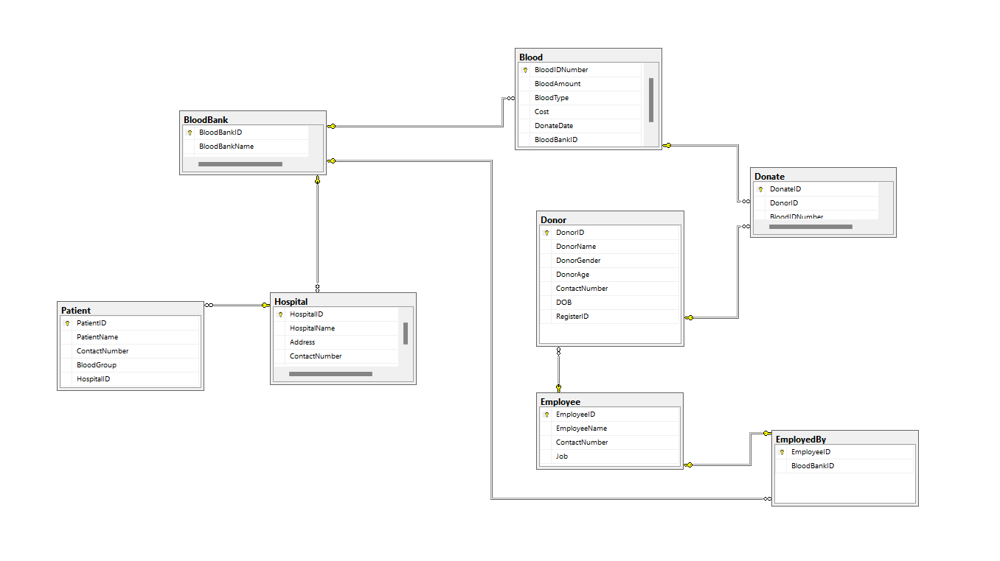
</div>
<br />

<br />


<!-- INSTALLATION -->

# INSTALLATION 💊

### Required software

* Java Development Kit (i.e. OpenJDK) [CLICK TO DOWNLOAD](https://openjdk.org/)
* Any Java IDE (i.e. JetBrains Intellij IDEA) [CLICK TO DOWNLOAD](https://www.jetbrains.com/idea/download/)
* SQL Server [CLICK TO DOWNLOAD](https://www.microsoft.com/en-us/sql-server/sql-server-downloads)

### Steps

1. Clone the repo
   ```sh
   git clone https://https://github.com/hahoang03/Blood-Donation-Project
   ```
2. Open in a Java IDE

<br />
<br />


<!-- CONTRIBUTING -->

# CONTRIBUTING 🌱

Contributions are what make the open source community such an amazing place to learn, inspire, and create. Any
contributions you make are **greatly appreciated**.

If you have a suggestion that would make this better, please fork the repo and create a pull request. You can also
simply open an issue with the tag "enhancement".
Don't forget to give the project a star! Thanks again!

1. Fork the Project
2. Create your Feature Branch (`git checkout -b feature/AmazingFeature`)
3. Commit your Changes (`git commit -m 'Add some AmazingFeature'`)
4. Push to the Branch (`git push origin feature/AmazingFeature`)
5. Open a Pull Request

<br />
<br />

<!-- ACKNOWLEDGMENTS -->

# ACKNOWLEDGEMENTS ❤️

We want to express our sincerest thanks to our lecturer and the people who have helped us to achieve this project's goals:
- []()	Assoc. Nguyen Thi Thuy Loan
- []()	MSc. Nguyen Quang Phu
- []()	The README.md template from **[othneildrew](https://github.com/othneildrew/Best-README-Template)**

<!-- MARKDOWN LINKS & IMAGES -->

[contributors-shield]:https://img.shields.io/github/contributors/hahoang03/Blood-Donation-Project.svg?style=for-the-badge

[contributors-url]: https://github.com/hahoang03/Blood-Donation-Project/graphs/contributors

[forks-shield]: https://img.shields.io/github/forks/hahoang03/Blood-Donation-Project.svg?style=for-the-badge

[forks-url]: https://github.com/hahoang03/Blood-Donation-Project/network/members

[issues-shield]: https://img.shields.io/github/issues/hahoang03/Blood-Donation-Project.svg?style=for-the-badge

[issues-url]: https://github.com/hahoang03/Blood-Donation-Project/issues

